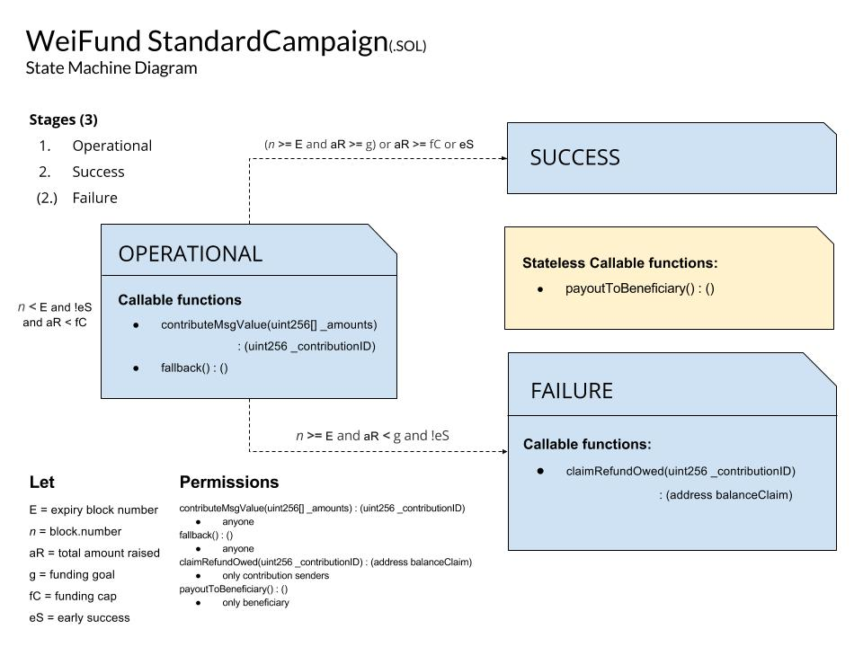
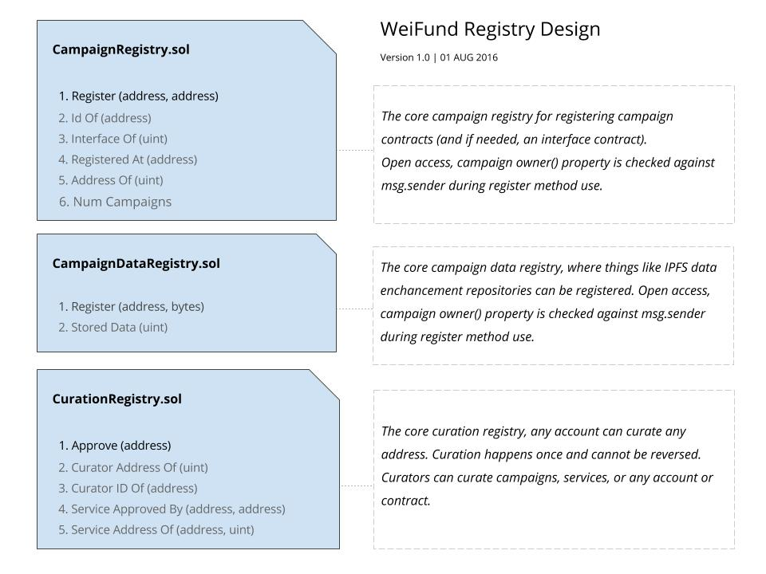

## StandardCampaign

### Actions

Campaigns have three transaction types:

* `contributeMsgValue`: Contribute to the campaign. Also available via the fallback function.
* `payoutToBeneficiary`: Withdraw the raised ether from the campaign.
* `claimRefundOwed`: Refund the funds you contributed to a campaign that didn't hit its goal.

### Stages

Campaigns are in stage `CrowdfundOperational` until they expire, hit their funding goal, or hit their funding cap. Campaigns that expired before reaching their goal are in stage `CrowdfundFailed`, which allows refunds. Campaigns that hit their funding goal or cap are in stage `CrowdfundSuccess`, which prevents further contributions.

### Early Success

Some campaigns have criteria other than the amount raised that determine when a campaign ends. For instance, token launches often have a cap on how many tokens will be issued. To handle this, campaigns can have an `Enhancer`. `Enhancer.notate` is like a contribution callback that receives information about the contributor, amount, and block. The return value from `Enhancer.notate` is used to trigger early success.

### Contributions

Nonzero contributions to operational campaigns that don't pass the funding cap are assigned an ID and recorded in storage.

### Payouts

The beneficiary can withdraw all funds from the contract at any time. Beneficiaries should not withdraw funds until the goal has been hit or something has gone wrong, but this restriction is not enforced since beneficiaries can always contribute to their own campaigns to hit the goal if they want. Treating the fundraising goal as a social restriction instead of a contract restriction allows the beneficiary to recover from errors.

### Refunds

Failed campaigns allow contributors to withdraw their refunds via a BalanceClaim contract.

## Claims

BalanceClaim is a risk-mitigation strategy for refunds. Instead of sending refunds to arbitrary contributor addresses, campaigns only send funds to the beneficiary and to addresses of BalanceClaim contracts the campaign has created. Reentrancy and stack overflow problems are mitigated by this strategy.

## IssuedToken

Campaigns that issue tokens to contributors can use an enhancer that issues tokens for each contribution. The enhancer is set as the `issuer` of the token, which is allowed to send `transfer` messages to the token that transfer newly created tokens to the recipient. These tokens are frozen until the specified `freezePeriod` has passed. Once the specified `lastIssuance` block has passed, the issuer cannot issue any more tokens, so the supply is permanently fixed.

## Verifier

Verifier contracts are used to manage token launches that require a whitelist of verified contributors. The verifier owner has permission to approve new accounts, and the enhancer for campaigns with a whitelist asks the verifier if each contributor is approved.

## Factories

Each factory is a `PrivateServiceRegistry` that manages an array of created contracts and their indices to make it easy to iterate through the contracts that have been created from the factory.

## Registries

`CurationRegistry`: Lets anyone approve campaigns. Campaign lists can use hardcoded or user-specified curators to display curated campaigns.

`CampaignRegistry`: Campaign owners can register their campaign with WeiFund. Even contracts with different ABIs can use this registry. The CurationRegistry is used to filter down the campaigns to display in the frontend.

`CampaignDataRegistry`: Campaign owners can register an IPFS hash of their campaign's metadata.
